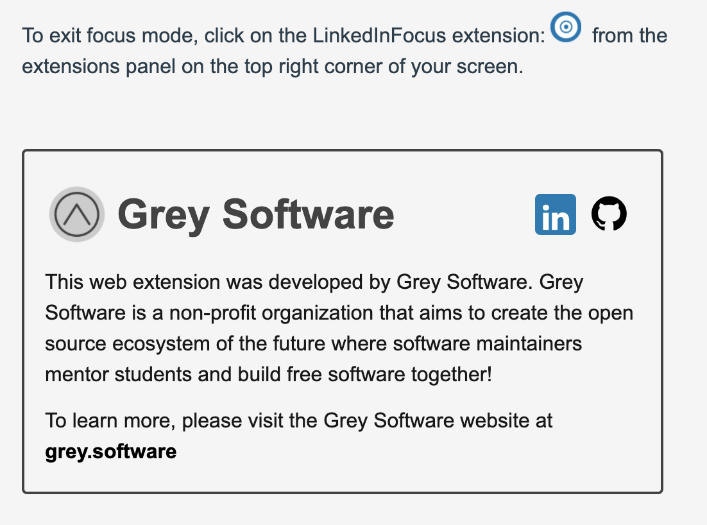
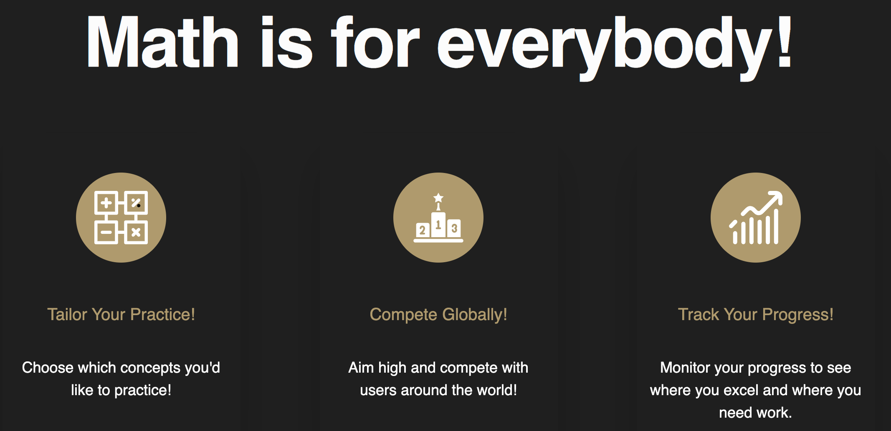

# This week in Grey Software 2020-07-26

This week, we iterated on our education model, and introduced a mechanism for automating the organization's processes.

## 💡 Iterating on the Educational Model

Grey Software currently hosts students as [apprentices](/apprentice) as they work on [Grey Software's projects](/projects). This education model is difficult to scale because since the application is being created and taught at the same time, it's hard to define a structured curriculum and predict learning outcomes.

Our new proposed model is that each project have teams for both creation and education.

The creation team looks to evolve Grey Software's apps and products by using the latest and most efficacious technologies and trends in software development. Some of these tools and practices may be experimental, and inaccessible as teaching content. 

The education team follows the lead of the creation team, and turns the app into a viable teaching project. The curriclum developers abstract away certain complexities of the app, allowing students to harmoniously make their way to the complexity of the code on master. 

### We envision a positive feedback loop between the two teams. 

As the creation team tries new technologies and processes, the education team can embed them into the curriculum to keep their educational content relevant to the technological landscape of the time.  

As the educational team abstracts away complexity and modularizes the project's codebase, the creation team benefits from a healthier codebase with high cohesion and low coupling. As a result, their creative efforts are bolstered by a structured, yet flexible foundation.  

## ⚙️ The birth of Grey Khan

Grey Khan watches over Grey Software by automating the organization's operational tasks. Grey started off by creating [an automated weekly team meeting agenda](https://github.com/grey-software/org/issues/39) and creating [daily standup issues](https://github.com/grey-software/Material-Math/issues/51). 

We've setup [a repo](https://github.com/grey-software/automation) to manage and discuss more opportunities for automation.  

## 💚 Encountering DWYL

We encountered the work of the team over at [Do What You Love](https://github.com/dwyl/start-here). We feel they align with Grey Software philosophically, and their body of work, including their [handbook on processes](https://github.com/dwyl/process-handbook) are very impressive.  

They created [the label tool](https://label-sync.herokuapp.com/) we use to sync [our labels](https://github.com/grey-software/github-labels) across the org and across Github. Grey Software has reached out to help with the description bug in their tool. 

## 📢 Raising awareness for Grey Software on LinkedIn Focus

We're planning to raise awareness for the cause through advertising the mission on the online real estate afforded to us by LinkedIn Focus, which is [now live and unlisted on the chrome web store](https://chrome.google.com/webstore/detail/linkedin-focus/cmafljjdkloacahjddlpaognhjpacdff?hl=en&authuser=2)

## Material Math Landing Page on the Grey Software Website

We developed [a landing page for Material Math](https://grey.software/material-math/) on the Grey Software website. 

